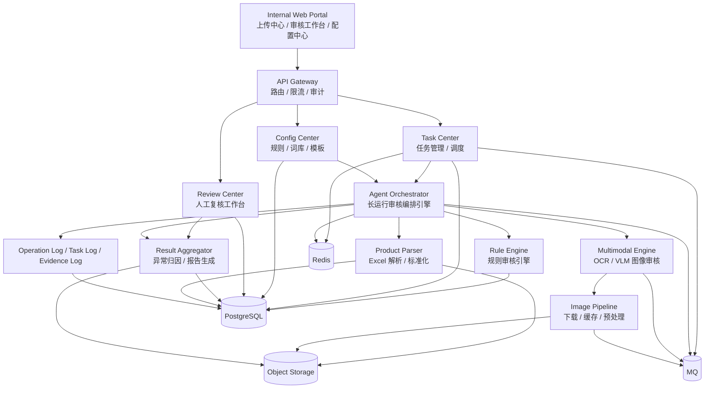
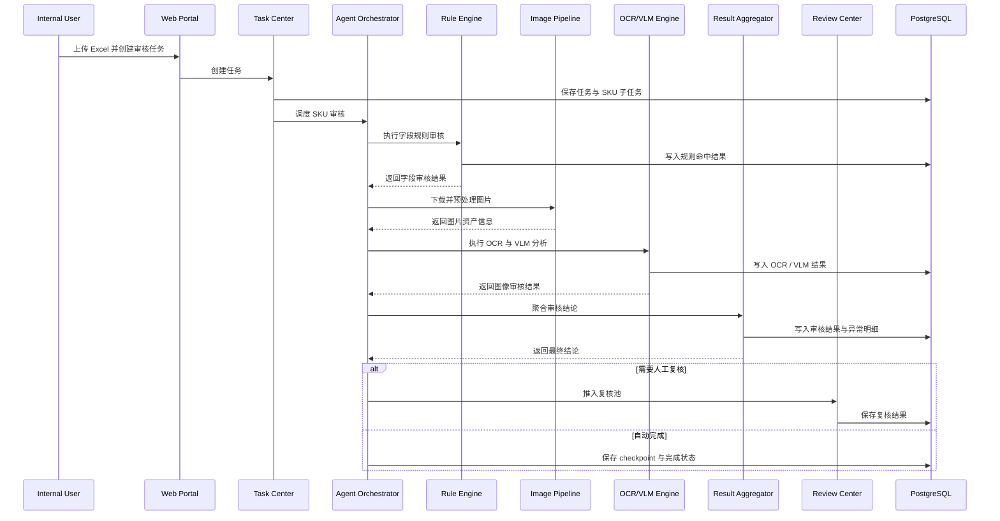
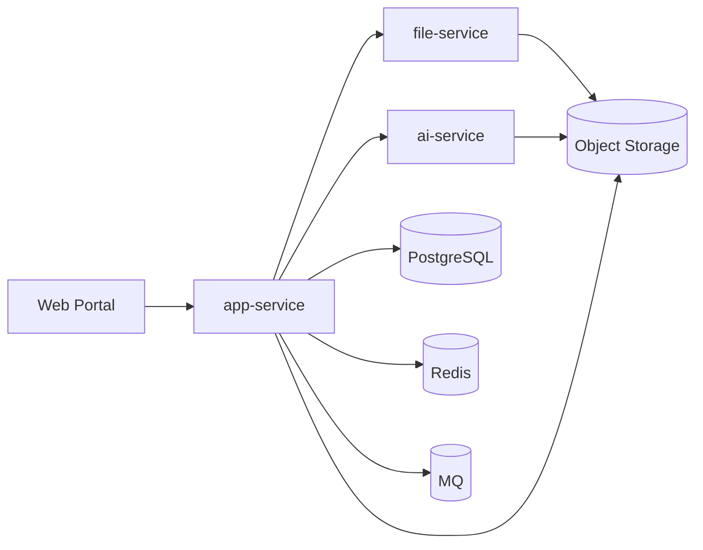
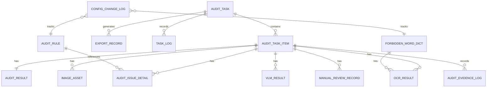

# 商品审核 Agent 平台架构设计说明书

## 1. 文档信息

* **文档名称**：商品审核 Agent 平台架构设计说明书
* **文档版本**：V1.0
* **文档状态**：正式版
* **适用范围**：企业内部商品上架审核业务
* **编制日期**：2026-04-03

---

## 2. 项目背景

当前商品上架审核主要依赖人工对供应商提供的 Excel 数据进行字段检查、价格核验、图片审核和异常反馈。该方式存在以下问题：

1. 审核规则分散在文档和人工经验中，执行标准不一致。
2. 单批次商品量大、图片多，人工审核效率低，容易遗漏问题。
3. 图片中的商品主体、销售单位、违禁词等内容难以通过传统规则程序准确识别。
4. 审核过程缺少统一的过程留痕、结果归因和异常导出机制。
5. 当任务量较大时，缺少可恢复、可重试、可观测的批量审核执行框架。

基于以上问题，需建设一套企业内部使用的 **商品审核 Agent 平台**，将结构化规则审核与 OCR / VLM 多模态审核能力结合起来，形成可编排、可追溯、可复核的智能审核体系。

---

## 3. 建设目标

本系统建设目标如下：

### 3.1 业务目标

* 支持供应商商品 Excel 批量导入与标准化解析。
* 支持按 SKU 维度执行自动审核。
* 支持对标题、品牌、类目、价格等字段进行规则校验。
* 支持对主图、详情图进行 OCR 违禁词检测和多模态一致性检测。
* 支持自动汇总异常原因并生成标准化《异常 SKU》报告。
* 支持低置信度结果进入人工复核闭环。

### 3.2 技术目标

* 建立面向长运行任务的 Agent 编排框架。
* 支持审核任务异步执行、失败重试、断点恢复。
* 建立统一的规则中心和词库中心。
* 建立完整的操作日志、审核日志和配置变更日志体系。
* 提供清晰的模块边界，便于后续扩展更多审核规则和智能能力。

---

## 4. 系统定位与范围

### 4.1 系统定位

本系统定位为：

> 面向企业内部商品上架流程的智能审核平台，以 SKU 为最小处理单元，以 Agent 编排为流程核心，以规则引擎和多模态模型为执行器，以人工复核和审核留痕为闭环保障，实现批量商品审核、异常归因和标准化报告输出。

### 4.2 范围边界

本期系统包含以下能力：

* 商品 Excel 上传与解析
* 审核任务创建与执行
* 基础字段审核
* OCR 违禁词识别
* 主图销售单位识别与比对
* 商品主体图文一致性识别
* 人工复核
* 异常 SKU 导出
* 操作与审核留痕

本期系统不包含以下能力：

* 独立用户管理系统
* 复杂角色权限体系
* 多租户隔离能力
* 对外 SaaS 商业化能力

说明：系统默认依赖企业内部统一身份体系，平台自身不单独建设用户、角色、权限模块，但需保留所有关键操作日志。

---

## 5. 总体架构设计

### 5.1 总体设计原则

系统设计遵循以下原则：

1. **规则优先，AI 增强**：可通过确定性规则解决的问题优先由规则引擎处理，仅在图像理解、主体识别、语义比对等场景引入 AI。
2. **任务异步化**：批量审核任务必须通过异步执行框架处理，避免同步阻塞。
3. **SKU 原子化处理**：以 SKU 为最小审核单元，保证可重试、可恢复、可跟踪。
4. **Agent 编排化**：采用长运行 Agent 作为审核流程的统一编排层。
5. **可观测与可追溯**：记录操作、系统执行和审核证据，保证全过程可解释。
6. **配置驱动**：规则、词库、模板等可通过配置中心维护，避免硬编码。

### 5.2 逻辑架构

```text
                    ┌─────────────────────────────┐
                    │      Internal Web Portal     │
                    │ 上传中心 / 审核工作台 / 配置中心 │
                    └──────────────┬──────────────┘
                                   │
                    ┌──────────────▼──────────────┐
                    │          API Gateway         │
                    │      路由 / 限流 / 审计       │
                    └──────────────┬──────────────┘
                                   │
      ┌────────────────────────────┼────────────────────────────┐
      │                            │                            │
┌─────▼─────┐              ┌───────▼────────┐           ┌──────▼──────┐
│ Task Center│              │ Config Center  │           │ Review Center│
│任务管理/调度│              │规则/词库/模板   │           │人工复核工作台 │
└─────┬─────┘              └───────┬────────┘           └──────┬──────┘
      │                            │                            │
      └───────────────┬────────────┴───────────────┬────────────┘
                      │                            │
             ┌────────▼────────┐         ┌────────▼─────────┐
             │ Agent Orchestrator│         │ Result Aggregator│
             │ 长运行审核编排引擎 │         │ 异常归因/报告生成 │
             └───────┬───────┬──┘         └────────┬─────────┘
                     │       │                       │
         ┌───────────▼─┐   ┌─▼────────────────┐      │
         │ Rule Engine  │   │ Multimodal Engine │      │
         │ 规则审核引擎  │   │ OCR/VLM图像审核   │      │
         └──────┬──────┘   └────────┬─────────┘      │
                │                   │                │
       ┌────────▼────────┐  ┌───────▼────────┐       │
       │ Product Parser   │  │ Image Pipeline  │       │
       │ Excel解析/标准化 │  │ 下载/缓存/预处理 │       │
       └────────┬────────┘  └───────┬────────┘       │
                │                   │                │
       ┌────────▼───────────────────▼────────────────▼────────┐
       │                    Data & Infra Layer                │
       │ PostgreSQL / Redis / MQ / Object Storage / Logs      │
       └───────────────────────────────────────────────────────┘
```

### 5.3 分层说明

#### 表现层

提供上传、审核、复核、配置和导出等页面能力。

#### 接入层

通过 API Gateway 统一处理路由、限流、请求日志和内部身份透传。

#### 业务层

包含任务中心、配置中心、复核中心、结果聚合器等核心业务模块。

#### 编排层

通过 Agent Orchestrator 组织审核流程和工具调用。

#### 能力层

由规则引擎、OCR/VLM 多模态引擎、图片处理管线等组成。

#### 数据与基础设施层

承担持久化、缓存、队列、对象存储和日志能力。

---

## 6. 核心模块设计

### 6.1 Internal Web Portal

用于企业内部人员操作，主要页面包括：

* 上传中心
* 审核任务列表
* SKU 审核详情页
* 人工复核工作台
* 规则配置页
* 违禁词库维护页
* 操作日志页
* 导出记录页

### 6.2 API Gateway

主要职责：

* API 路由与转发
* 内部登录态透传
* 限流与请求保护
* 请求日志记录
* Trace ID 注入

### 6.3 Task Center

任务中心负责审核任务的全生命周期管理。

主要功能：

* 创建审核任务
* 解析 Excel 并拆分 SKU 子任务
* 维护任务状态和进度
* 支持暂停、恢复、取消
* 支持失败重试
* 汇总任务结果

建议状态设计：

#### 任务状态

* CREATED
* QUEUED
* RUNNING
* PAUSED
* COMPLETED
* PARTIAL_FAILED
* FAILED
* CANCELED

#### SKU 状态

* PENDING
* PROCESSING
* PASSED
* REJECTED
* NEED_REVIEW
* FAILED

### 6.4 Agent Orchestrator

Agent Orchestrator 是系统的流程编排核心，负责按步骤执行 SKU 审核流程。

标准处理链路如下：

```text
加载 SKU
→ 字段规则审核
→ 图片下载
→ OCR 识别
→ VLM 图像分析
→ 结果聚合
→ 人工复核判断
→ 结果持久化
→ checkpoint 保存
```

设计要求：

* 每个 SKU 必须可独立处理
* 每个步骤必须可记录执行结果
* 失败步骤必须支持重试
* 中断后必须支持恢复

### 6.5 Product Parser

负责对 Excel 数据进行读取和标准化。

能力包括：

* 模板识别
* 表头映射
* 字段清洗
* SKU 拆分
* 图片链接解析
* 数据标准化输出

标准化输出对象建议：

```json
{
  "taskId": "T20260403001",
  "skuId": "SKU12345",
  "title": "品牌A 保温杯 500ml 1个装 办公室便携",
  "brandName": "品牌A",
  "saleUnit": "个",
  "priceFactory": 18.5,
  "priceRetail": 39.9,
  "mainImages": ["..."],
  "detailImages": ["..."],
  "stdCategoryIdPath": "家居>水具>保温杯"
}
```

### 6.6 Rule Engine

规则引擎负责处理确定性审核逻辑。

规则分类包括：

#### 字段规范规则

* 标题格式
* 标题长度
* 品牌一致性
* 类目完整性
* 空值校验

#### 价格逻辑规则

* 成本价与运费关系
* 出厂价与零售价关系
* 平台价对比
* 毛利区间预警

#### 词库规则

* 文本违禁词
* OCR 图片违禁词
* 品类专属禁用词

#### 枚举规则

* saleUnit 合法性
* 规格模式规范性
* 售后字段校验

规则建议采用配置驱动形式，例如：

```json
{
  "ruleCode": "TITLE_LENGTH_MAX_30",
  "ruleType": "FIELD_VALIDATION",
  "field": "title",
  "operator": "length_lte",
  "value": 30,
  "severity": "REJECT"
}
```

### 6.7 Image Pipeline

图片处理管线负责图像资源的接入与预处理。

主要步骤：

1. 图片下载
2. 图片有效性校验
3. 去重
4. 格式标准化
5. 缩放压缩
6. OCR 前处理
7. VLM 输入准备
8. 结果缓存

关键要求：

* 支持并发下载
* 支持失败重试
* 支持缓存复用
* 支持图片结果持久化到对象存储

### 6.8 Multimodal Engine

多模态审核引擎由 OCR 能力和 VLM 能力组成。

#### OCR 能力

负责从图片中提取文字与位置信息，并与违禁词库比对。

输出内容：

* 识别文本
* 命中违禁词
* 命中位置坐标
* 命中图片编号

#### VLM 能力

负责完成以下任务：

1. saleUnit 与图片展示单位匹配
2. 图片主体与标题主体一致性校验
3. 视觉语义冲突识别

建议输出：

* 判断结果
* 证据图片序号
* 说明文本
* 模型置信度

### 6.9 Result Aggregator

结果聚合器负责将规则结果和图像结果统一汇总为业务可用结论。

核心职责：

* 生成标准 reject reasons
* 生成 detail 描述
* 判断是否需要人工复核
* 生成导出结果数据

示例：

```json
{
  "skuId": "SKU12345",
  "status": "REJECTED",
  "rejectReasons": [
    "标题不规范",
    "图文销售单位不匹配",
    "图片包含违禁词"
  ],
  "detail": "1. 标题未包含品牌；2. 主图第2张展示为单件，与saleUnit(箱)不匹配；3. 主图第1张存在违禁词【京东物流】。",
  "needsHumanReview": false
}
```

### 6.10 Review Center

人工复核中心负责处理自动审核无法确定或需要人工仲裁的结果。

触发场景包括：

* OCR 识别文本不清晰
* VLM 置信度低
* 图像判断冲突
* 价格异常过大
* 多规则结论冲突

复核能力包括：

* 查看原始 SKU 数据
* 查看图片与 OCR 标注
* 查看模型判断结果
* 手工改判
* 补充复核备注
* 记录改判历史

### 6.11 Config Center

配置中心负责系统规则资产的维护。

维护内容包括：

* 违禁词库
* 标题审核规则
* 价格阈值
* 类目映射表
* 驳回原因枚举
* 导出模板

配置要求：

* 支持版本管理
* 支持修改留痕
* 支持发布记录

---

## 7. Agent 执行链路设计

### 7.1 端到端执行流程

```text
上传 Excel
→ 创建审核任务
→ Excel 解析与 SKU 拆分
→ SKU 入队
→ Agent 调度 SKU 审核
→ 字段规则审核
→ 图片下载与预处理
→ OCR 识别
→ VLM 图像分析
→ 结果聚合
→ 人工复核判断
→ 结果持久化
→ 导出异常 SKU 报告
→ 任务完成
```

### 7.2 单 SKU 审核流程

```text
Load SKU State
→ 字段完整性校验
→ 标题/品牌/类目审核
→ 价格逻辑审核
→ 图片下载
→ OCR 违禁词检测
→ saleUnit 视觉匹配
→ 商品主体图文一致性检测
→ 异常合并
→ 风险分级
→ 人工复核判断
→ Persist Result + Checkpoint
```

### 7.3 Checkpoint 机制

为确保长运行任务可恢复，系统需在每个 SKU 审核完成后保存状态快照。支持：

* 中断恢复
* 失败重试
* 定位失败步骤
* 跳过已完成项

---

## 8. 数据架构设计

### 8.1 存储选型

#### PostgreSQL

用于存储：

* 审核任务
* SKU 子任务
* 审核结果
* 异常明细
* 规则配置
* 复核记录
* 日志记录

#### Redis

用于存储：

* 任务进度
* 临时状态
* 分布式锁
* 热点缓存

#### Object Storage

用于存储：

* 上传的 Excel 文件
* 图片缓存文件
* OCR 标注图
* 导出文件

#### MQ

用于承载：

* 审核任务队列
* 图片处理队列
* OCR / VLM 任务队列
* 重试队列

### 8.2 核心数据表建议

* `audit_task`：审核任务主表
* `audit_task_item`：SKU 子任务表
* `audit_result`：审核结果表
* `audit_issue_detail`：异常明细表
* `audit_rule`：审核规则表
* `forbidden_word_dict`：违禁词字典表
* `image_asset`：图片资源表
* `ocr_result`：OCR 结果表
* `vlm_result`：多模态结果表
* `manual_review_record`：人工复核记录表
* `export_record`：导出记录表
* `operation_log`：操作日志表
* `task_log`：任务日志表
* `config_change_log`：配置变更日志表

---

## 9. 日志与审计设计

### 9.1 操作日志

用于记录“谁做了什么”。

典型事件包括：

* 上传文件
* 创建任务
* 暂停任务
* 恢复任务
* 取消任务
* 导出结果
* 修改规则
* 修改违禁词库
* 提交人工复核

示例结构：

```json
{
  "operator": "zhangsan",
  "action": "CREATE_TASK",
  "targetType": "AUDIT_TASK",
  "targetId": "TASK_20260403_001",
  "detail": "上传商品审核文件并创建审核任务",
  "createdAt": "2026-04-03T10:00:00"
}
```

### 9.2 任务日志

用于记录系统执行过程。

示例内容：

* 任务创建成功
* SKU 入队成功
* 图片下载失败
* OCR 调用超时
* VLM 分析完成
* SKU 审核完成
* 导出文件生成成功

### 9.3 审核证据日志

用于记录系统判定依据，保证结果可解释。

内容包括：

* 命中规则编号
* OCR 命中文本与坐标
* 图片编号与问题类型
* VLM 判断说明
* 模型置信度
* 人工改判记录

---

## 10. 高并发与可扩展设计

### 10.1 并发设计

建议按三层并发：

* **任务级并发**：多个审核任务并行执行
* **SKU 级并发**：同一任务下多个 SKU 并行审核
* **图片级并发**：单个 SKU 下多张图并发下载和 OCR

### 10.2 限流策略

为控制资源消耗与模型成本，建议采用以下限制：

* 单任务最大并发 SKU 数
* 单 SKU 最大图片并发数
* OCR 服务调用频率限制
* VLM 服务调用频率限制

### 10.3 缓存策略

建议缓存：

* 图片下载结果
* OCR 识别结果
* VLM 识别结果
* 标题主体抽取结果
* 违禁词匹配结果

---

## 11. 部署架构建议

### 11.1 初期部署方案

建议采用以下服务部署：

* Web / API 服务
* 审核编排服务
* AI 推理服务
* 文件服务
* PostgreSQL
* Redis
* MQ
* Object Storage

### 11.2 服务拆分建议

#### 初期三服务方案

1. **app-service**

   * API 接口
   * 任务中心
   * 编排逻辑
   * 配置中心
   * 复核中心
   * 日志服务

2. **ai-service**

   * OCR
   * VLM
   * 图像智能分析

3. **file-service**

   * 文件上传
   * 图片缓存
   * 导出文件管理

#### 后续演进方案

根据任务量与推理负载，可逐步演进为：

* gateway-service
* audit-core-service
* config-service
* ai-service
* asset-service
* review-service
* report-service

### 11.3 容器化建议

系统后续可通过 Kubernetes 进行容器化部署，以支持：

* OCR / VLM 服务弹性扩缩容
* 队列消费弹性调度
* 多环境隔离
* 故障自动恢复

---

## 12. 非功能设计

### 12.1 可用性

* 审核任务支持断点恢复
* 关键服务支持失败重试
* 外部模型调用支持超时控制与熔断

### 12.2 可维护性

* 模块边界清晰
* 规则配置可管理
* 日志可追踪
* 错误可定位

### 12.3 可扩展性

* 规则可扩展
* 词库可扩展
* 图像审核能力可扩展
* 支持后续接入相似商品检索、价格对标等能力

### 12.4 安全性

* 文件类型校验
* 下载链接安全控制
* 图片内容安全控制
* 敏感数据脱敏
* 配置修改留痕

---

## 13. 演进路线建议

### 13.1 MVP 阶段

实现最小闭环：

* Excel 上传
* 字段规则审核
* 图片下载
* OCR 违禁词识别
* 异常 SKU 导出
* 任务状态跟踪
* 基础日志记录

### 13.2 V2 阶段

增强能力：

* saleUnit 图像匹配
* 商品主体图文一致性识别
* 人工复核工作台
* 配置中心版本管理
* 更细粒度的审核证据留痕

### 13.3 V3 阶段

进一步扩展：

* 历史案例召回
* 相似商品向量检索
* 审核策略优化
* 模型效果评估体系
* 自动化反馈学习闭环

---

## 14. 结论

商品审核 Agent 平台不是一个简单的 Excel 解析工具，也不是单点 OCR 服务，而是一套围绕商品审核全流程构建的智能审核中台。

系统以 SKU 为处理原子，以 Agent 为流程编排中枢，以规则引擎和多模态能力为执行基础，以人工复核与日志留痕为闭环保障，能够有效提升商品审核效率、统一审核标准、降低人工成本，并为后续智能化扩展奠定工程基础。

---

## 15. Mermaid 架构图

### 15.1 总体架构图



### 15.2 单 SKU 审核时序图



### 15.3 微服务部署图



## 16. 数据库表设计

### 16.1 设计原则

数据库表设计遵循以下原则：

1. 以审核任务和 SKU 子任务为主线组织核心数据。
2. 规则结果、OCR 结果、VLM 结果、人工复核结果相互解耦，便于独立扩展。
3. 关键业务动作和配置修改必须具备留痕能力。
4. 导出、日志、图片资产等辅助对象独立建表，避免主表过度膨胀。

### 16.2 核心表清单

| 表名                   | 用途        |
| :------------------- | :-------- |
| audit_task           | 审核任务主表    |
| audit_task_item      | SKU 子任务表  |
| audit_result         | SKU 审核结论表 |
| audit_issue_detail   | SKU 异常明细表 |
| audit_rule           | 审核规则定义表   |
| forbidden_word_dict  | 违禁词字典表    |
| image_asset          | 图片资源表     |
| ocr_result           | OCR 结果表   |
| vlm_result           | 多模态分析结果表  |
| manual_review_record | 人工复核记录表   |
| export_record        | 导出记录表     |
| operation_log        | 操作日志表     |
| task_log             | 任务日志表     |
| audit_evidence_log   | 审核证据日志表   |
| config_change_log    | 配置变更日志表   |

### 16.3 核心实体关系



### 16.4 主要数据表设计

#### 16.4.1 audit_task（审核任务主表）

用于记录一次批量审核任务的基本信息。

| 字段名                 | 类型            | 说明       |
| :------------------ | :------------ | :------- |
| id                  | bigint / uuid | 主键       |
| task_code           | varchar(64)   | 任务编码，唯一  |
| task_name           | varchar(128)  | 任务名称     |
| source_file_name    | varchar(256)  | 原始文件名    |
| source_file_url     | varchar(512)  | 原始文件存储地址 |
| status              | varchar(32)   | 任务状态     |
| total_sku_count     | int           | SKU 总数   |
| processed_sku_count | int           | 已处理数量    |
| passed_sku_count    | int           | 审核通过数量   |
| rejected_sku_count  | int           | 审核驳回数量   |
| review_sku_count    | int           | 待人工复核数量  |
| failed_sku_count    | int           | 处理失败数量   |
| created_by          | varchar(64)   | 创建人      |
| started_at          | timestamp     | 开始时间     |
| finished_at         | timestamp     | 结束时间     |
| created_at          | timestamp     | 创建时间     |
| updated_at          | timestamp     | 更新时间     |

建议索引：

* unique(task_code)
* index(status)
* index(created_at)

#### 16.4.2 audit_task_item（SKU 子任务表）

用于记录任务下每个 SKU 的处理对象及其状态。

| 字段名                  | 类型            | 说明            |
| :------------------- | :------------ | :------------ |
| id                   | bigint / uuid | 主键            |
| task_id              | bigint / uuid | 所属任务 ID       |
| sku_id               | varchar(64)   | SKU 编码        |
| item_name            | varchar(256)  | 商品名称          |
| brand_name           | varchar(128)  | 品牌名称          |
| sale_unit            | varchar(32)   | 销售单位          |
| category_path        | varchar(512)  | 类目路径          |
| price_factory        | decimal(12,2) | 出厂价           |
| price_retail         | decimal(12,2) | 零售价           |
| price_other_platform | decimal(12,2) | 其他平台价格 / 京东价格 |
| raw_payload          | jsonb         | 标准化后的原始数据     |
| status               | varchar(32)   | SKU 状态        |
| current_step         | varchar(64)   | 当前执行步骤        |
| retry_count          | int           | 重试次数          |
| checkpoint_data      | jsonb         | checkpoint 快照 |
| error_message        | text          | 失败原因          |
| created_at           | timestamp     | 创建时间          |
| updated_at           | timestamp     | 更新时间          |

建议索引：

* index(task_id)
* index(task_id, status)
* index(sku_id)

#### 16.4.3 audit_result（审核结论表）

用于记录每个 SKU 的最终审核结果。

| 字段名                | 类型            | 说明                                   |
| :----------------- | :------------ | :----------------------------------- |
| id                 | bigint / uuid | 主键                                   |
| task_item_id       | bigint / uuid | SKU 子任务 ID                           |
| final_status       | varchar(32)   | 最终状态：PASSED / REJECTED / NEED_REVIEW |
| reject_reasons     | jsonb         | 驳回原因列表                               |
| detail_text        | text          | 备注详述                                 |
| risk_level         | varchar(16)   | 风险等级                                 |
| needs_human_review | boolean       | 是否需人工复核                              |
| reviewed_by        | varchar(64)   | 最终复核人                                |
| reviewed_at        | timestamp     | 最终复核时间                               |
| created_at         | timestamp     | 创建时间                                 |
| updated_at         | timestamp     | 更新时间                                 |

建议索引：

* unique(task_item_id)
* index(final_status)

#### 16.4.4 audit_issue_detail（异常明细表）

用于记录一个 SKU 命中的每一条异常。

| 字段名          | 类型            | 说明                                 |
| :----------- | :------------ | :--------------------------------- |
| id           | bigint / uuid | 主键                                 |
| task_item_id | bigint / uuid | SKU 子任务 ID                         |
| rule_id      | bigint / uuid | 关联规则 ID，可为空                        |
| issue_code   | varchar(64)   | 异常编码                               |
| issue_name   | varchar(128)  | 异常名称                               |
| issue_type   | varchar(32)   | FIELD / OCR / VLM / PRICE / MANUAL |
| severity     | varchar(16)   | INFO / WARN / REJECT               |
| evidence_ref | varchar(256)  | 证据引用，如图片编号、OCR 区块                  |
| detail_text  | text          | 明细描述                               |
| created_at   | timestamp     | 创建时间                               |

建议索引：

* index(task_item_id)
* index(issue_code)

#### 16.4.5 audit_rule（审核规则表）

用于维护可配置规则。

| 字段名          | 类型            | 说明                                    |
| :----------- | :------------ | :------------------------------------ |
| id           | bigint / uuid | 主键                                    |
| rule_code    | varchar(64)   | 规则编码                                  |
| rule_name    | varchar(128)  | 规则名称                                  |
| rule_type    | varchar(32)   | FIELD_VALIDATION / PRICE / OCR / ENUM |
| target_field | varchar(64)   | 目标字段                                  |
| operator     | varchar(32)   | 运算符                                   |
| rule_value   | jsonb         | 规则参数                                  |
| severity     | varchar(16)   | 处理级别                                  |
| enabled      | boolean       | 是否启用                                  |
| version_no   | varchar(32)   | 版本号                                   |
| description  | text          | 规则说明                                  |
| created_by   | varchar(64)   | 创建人                                   |
| updated_by   | varchar(64)   | 更新人                                   |
| created_at   | timestamp     | 创建时间                                  |
| updated_at   | timestamp     | 更新时间                                  |

建议索引：

* unique(rule_code)
* index(rule_type)
* index(enabled)

#### 16.4.6 forbidden_word_dict（违禁词字典表）

用于维护文本和图片审核共享的违禁词库。

| 字段名        | 类型            | 说明                    |
| :--------- | :------------ | :-------------------- |
| id         | bigint / uuid | 主键                    |
| word       | varchar(128)  | 违禁词                   |
| category   | varchar(64)   | 类别：极限词 / 平台词 / 物流词    |
| match_mode | varchar(16)   | EXACT / FUZZY / REGEX |
| severity   | varchar(16)   | WARN / REJECT         |
| enabled    | boolean       | 是否启用                  |
| remark     | text          | 备注                    |
| created_by | varchar(64)   | 创建人                   |
| updated_by | varchar(64)   | 更新人                   |
| created_at | timestamp     | 创建时间                  |
| updated_at | timestamp     | 更新时间                  |

建议索引：

* unique(word)
* index(category)
* index(enabled)

#### 16.4.7 image_asset（图片资源表）

用于管理 SKU 关联的图片资产。

| 字段名             | 类型            | 说明            |
| :-------------- | :------------ | :------------ |
| id              | bigint / uuid | 主键            |
| task_item_id    | bigint / uuid | SKU 子任务 ID    |
| image_type      | varchar(16)   | MAIN / DETAIL |
| image_index     | int           | 图片序号          |
| source_url      | varchar(512)  | 原始图片地址        |
| storage_url     | varchar(512)  | 对象存储地址        |
| file_hash       | varchar(128)  | 文件哈希          |
| download_status | varchar(32)   | 下载状态          |
| width           | int           | 图片宽度          |
| height          | int           | 图片高度          |
| created_at      | timestamp     | 创建时间          |
| updated_at      | timestamp     | 更新时间          |

建议索引：

* index(task_item_id)
* index(file_hash)

#### 16.4.8 ocr_result（OCR 结果表）

用于存储图片 OCR 识别结果。

| 字段名            | 类型            | 说明         |
| :------------- | :------------ | :--------- |
| id             | bigint / uuid | 主键         |
| task_item_id   | bigint / uuid | SKU 子任务 ID |
| image_asset_id | bigint / uuid | 图片资源 ID    |
| full_text      | text          | OCR 全量文本   |
| block_result   | jsonb         | 文本块与坐标     |
| hit_words      | jsonb         | 命中的违禁词列表   |
| hit_count      | int           | 命中数量       |
| ocr_confidence | decimal(5,4)  | OCR 置信度    |
| created_at     | timestamp     | 创建时间       |

建议索引：

* index(task_item_id)
* index(image_asset_id)

#### 16.4.9 vlm_result（多模态结果表）

用于存储 saleUnit 匹配、主体一致性等多模态判断结果。

| 字段名            | 类型            | 说明                        |
| :------------- | :------------ | :------------------------ |
| id             | bigint / uuid | 主键                        |
| task_item_id   | bigint / uuid | SKU 子任务 ID                |
| image_asset_id | bigint / uuid | 图片资源 ID，可为空               |
| check_type     | varchar(32)   | SALE_UNIT / SUBJECT_MATCH |
| result_status  | varchar(16)   | PASS / FAIL / UNCERTAIN   |
| result_text    | text          | 判断说明                      |
| confidence     | decimal(5,4)  | 模型置信度                     |
| evidence_data  | jsonb         | 补充证据数据                    |
| created_at     | timestamp     | 创建时间                      |

建议索引：

* index(task_item_id)
* index(check_type)

#### 16.4.10 manual_review_record（人工复核记录表）

用于记录人工复核过程和改判结果。

| 字段名            | 类型            | 说明                                         |
| :------------- | :------------ | :----------------------------------------- |
| id             | bigint / uuid | 主键                                         |
| task_item_id   | bigint / uuid | SKU 子任务 ID                                 |
| review_status  | varchar(32)   | PENDING / APPROVED / REJECTED / OVERRIDDEN |
| before_status  | varchar(32)   | 改判前状态                                      |
| after_status   | varchar(32)   | 改判后状态                                      |
| review_comment | text          | 复核备注                                       |
| reviewed_by    | varchar(64)   | 复核人                                        |
| reviewed_at    | timestamp     | 复核时间                                       |
| created_at     | timestamp     | 创建时间                                       |

建议索引：

* index(task_item_id)
* index(review_status)

#### 16.4.11 export_record（导出记录表）

用于记录异常 SKU 导出文件信息。

| 字段名         | 类型            | 说明                          |
| :---------- | :------------ | :-------------------------- |
| id          | bigint / uuid | 主键                          |
| task_id     | bigint / uuid | 审核任务 ID                     |
| export_type | varchar(32)   | EXCEPTION_SKU / FULL_RESULT |
| file_name   | varchar(256)  | 文件名                         |
| file_url    | varchar(512)  | 文件地址                        |
| exported_by | varchar(64)   | 导出人                         |
| exported_at | timestamp     | 导出时间                        |
| created_at  | timestamp     | 创建时间                        |

建议索引：

* index(task_id)
* index(export_type)

#### 16.4.12 operation_log（操作日志表）

用于记录人工操作行为。

| 字段名           | 类型            | 说明      |
| :------------ | :------------ | :------ |
| id            | bigint / uuid | 主键      |
| operator_id   | varchar(64)   | 操作人 ID  |
| operator_name | varchar(128)  | 操作人姓名   |
| action        | varchar(64)   | 操作动作    |
| target_type   | varchar(64)   | 目标对象类型  |
| target_id     | varchar(128)  | 目标对象 ID |
| detail        | text          | 操作描述    |
| ip_address    | varchar(64)   | 来源 IP   |
| trace_id      | varchar(64)   | 链路标识    |
| created_at    | timestamp     | 创建时间    |

建议索引：

* index(operator_id)
* index(action)
* index(target_type, target_id)
* index(created_at)

#### 16.4.13 task_log（任务日志表）

用于记录系统任务执行过程。

| 字段名          | 类型            | 说明                  |
| :----------- | :------------ | :------------------ |
| id           | bigint / uuid | 主键                  |
| task_id      | bigint / uuid | 审核任务 ID             |
| task_item_id | bigint / uuid | SKU 子任务 ID，可为空      |
| log_level    | varchar(16)   | INFO / WARN / ERROR |
| step_name    | varchar(64)   | 执行步骤名称              |
| message      | text          | 日志内容                |
| trace_id     | varchar(64)   | 链路标识                |
| created_at   | timestamp     | 创建时间                |

建议索引：

* index(task_id)
* index(task_item_id)
* index(log_level)
* index(created_at)

#### 16.4.14 audit_evidence_log（审核证据日志表）

用于记录每次审核判定的证据详情。

| 字段名            | 类型            | 说明                        |
| :------------- | :------------ | :------------------------ |
| id             | bigint / uuid | 主键                        |
| task_item_id   | bigint / uuid | SKU 子任务 ID                |
| evidence_type  | varchar(32)   | RULE / OCR / VLM / MANUAL |
| evidence_key   | varchar(128)  | 证据键                       |
| evidence_value | jsonb         | 证据内容                      |
| summary_text   | text          | 摘要说明                      |
| created_at     | timestamp     | 创建时间                      |

建议索引：

* index(task_item_id)
* index(evidence_type)

#### 16.4.15 config_change_log（配置变更日志表）

用于记录规则、词库、模板等配置变更。

| 字段名          | 类型            | 说明                                 |
| :----------- | :------------ | :--------------------------------- |
| id           | bigint / uuid | 主键                                 |
| config_type  | varchar(64)   | RULE / FORBIDDEN_WORD / TEMPLATE   |
| config_id    | varchar(128)  | 配置对象 ID                            |
| change_type  | varchar(32)   | CREATE / UPDATE / DELETE / PUBLISH |
| before_value | jsonb         | 变更前值                               |
| after_value  | jsonb         | 变更后值                               |
| changed_by   | varchar(64)   | 变更人                                |
| changed_at   | timestamp     | 变更时间                               |
| created_at   | timestamp     | 创建时间                               |

建议索引：

* index(config_type)
* index(config_id)
* index(change_type)
* index(changed_at)

### 16.5 分区与归档建议

考虑到任务日志、审核证据日志、OCR/VLM 结果数据量可能快速增长，建议：

1. `task_log`、`audit_evidence_log` 按月分区。
2. `ocr_result`、`vlm_result` 根据任务时间或创建时间做冷热分层。
3. 历史导出文件和原始图片按保留期限归档到低频存储。
4. 对已完成超过固定周期的任务，可将 checkpoint 和中间过程压缩归档。

## 17. 附录：推荐技术栈

### 后端

* Python
* FastAPI
* Celery 或 Dramatiq
* PostgreSQL
* Redis
* RabbitMQ 或 Kafka
* MinIO / S3

### 前端

* React 或 Next.js
* 企业后台组件库
* ECharts

### AI 能力

* OCR：PaddleOCR / 云 OCR
* VLM：多模态模型服务
* 向量能力：Qdrant（后续可选）

